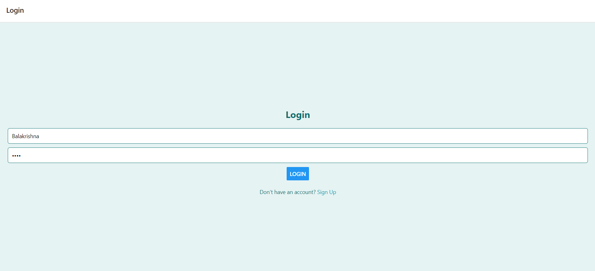
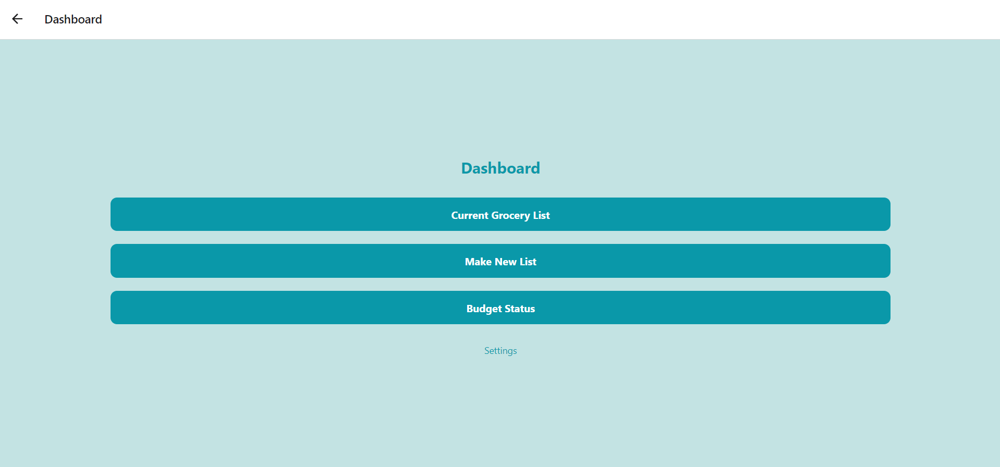
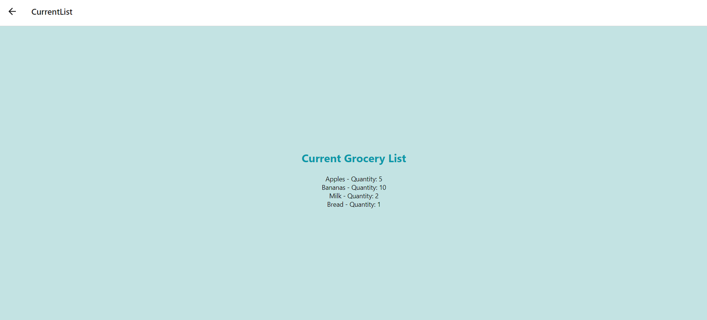
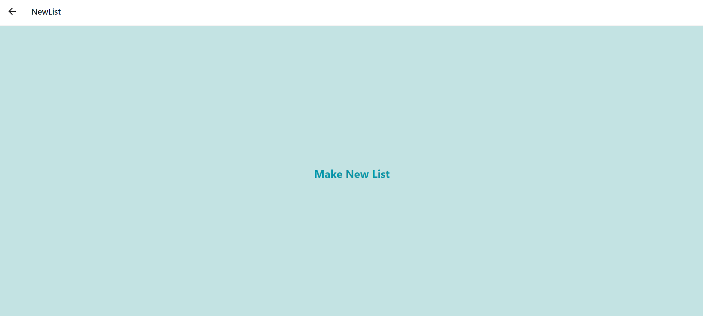
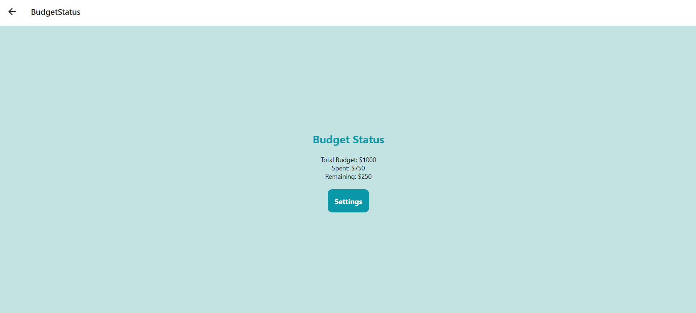
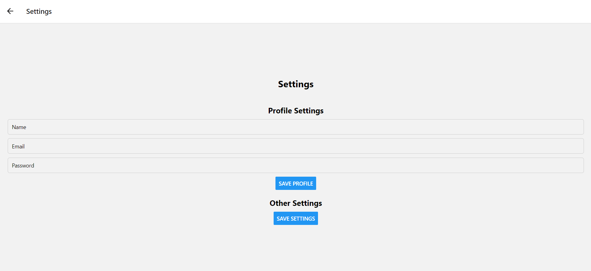

# Grocery Buddy App

Grocery Buddy is an app designed to help users manage their grocery lists, track budgets, and locate nearby stores.

## Features

- **Signup/Login**: Users can create an account or log in with their credentials.
- **Dashboard**: Provides an overview of grocery lists, budget status, and navigation to other sections.
- **Current Grocery List**: Allows users to view and manage their current grocery list.
- **New List**: Enables users to create a new grocery list by adding items.
- **Budget Status**: Helps users track their grocery spending and remaining budget.
- **Settings**: Allows users to update their profile details and preferences.

## Technologies Used

- React Native: Frontend framework for building cross-platform mobile apps.
- Redux: State management library for managing application state.
- React Navigation: Library for navigation between screens in React Native apps.
- Google Maps API: For locating nearby stores and supermarkets.

## Getting Started

To get started with the app, follow these steps:

Run the app on Android or iOS:
   - Android: `npx react-native run-android`
   - iOS: `npx react-native run-ios`

Note: Run the code when the Mobile Phone is connected to the laptop with the USB Debugging is turned on.

